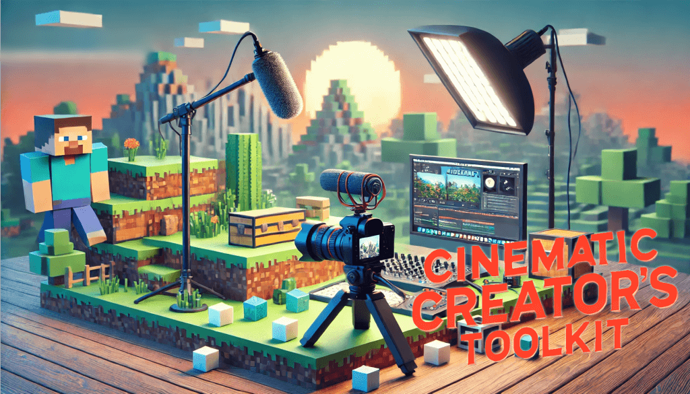

# 🎥 Cinematic Creator's Toolkit: Elevate Your Streaming Visuals

The Cinematic Creator's Toolkit is a comprehensive mod pack crafted for streamers and content
creators who want to enhance their visuals. This collection focuses on in-game aesthetics and
advanced camera controls to help creators produce engaging, cinematic-quality videos.

With high-quality shaders, dynamic lighting, and customizable camera angles, this toolkit transforms
your gameplay into an immersive experience that captivates viewers and elevates your content.

- 🖼️ Perfect for Showcases and Tutorials – Ideal for setups featuring single mods or tutorial-style
  content.
- ⚠️ Not for Large Mod Packs – For optimal performance, use this pack as-is to maintain the
  creator's intended quality.
- 🚫 Avoid Using on Public Servers – Some mods in this pack may lead to bans if used on servers you
  don’t own or manage.
